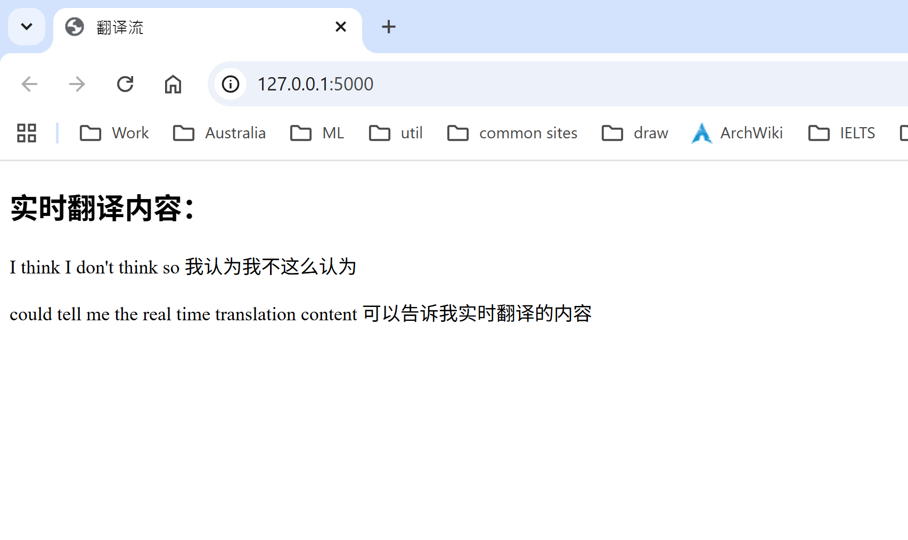
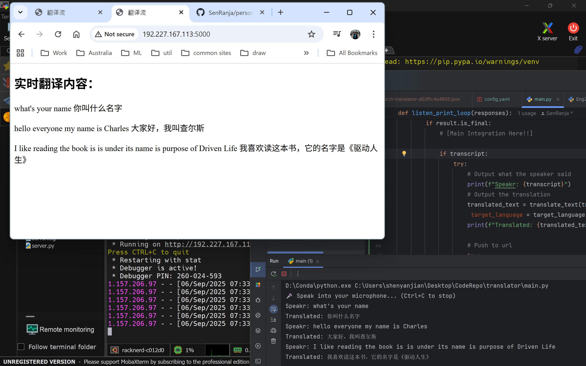

# Google Cloud Service

How to establish API foundation?

Refer my youtube video: https://www.youtube.com/watch?v=7Lqz3eimb64


# pip initial

```shell
pip install google-cloud-translate
pip install google-auth
pip install google-auth-oauthlib
pip install google-api-core
pip install google-cloud-speech
pip install pipwin

#pipwin install pyaudio
pip install pyaudio
pip install google-cloud-core
```

# Push service

With the flask service.







